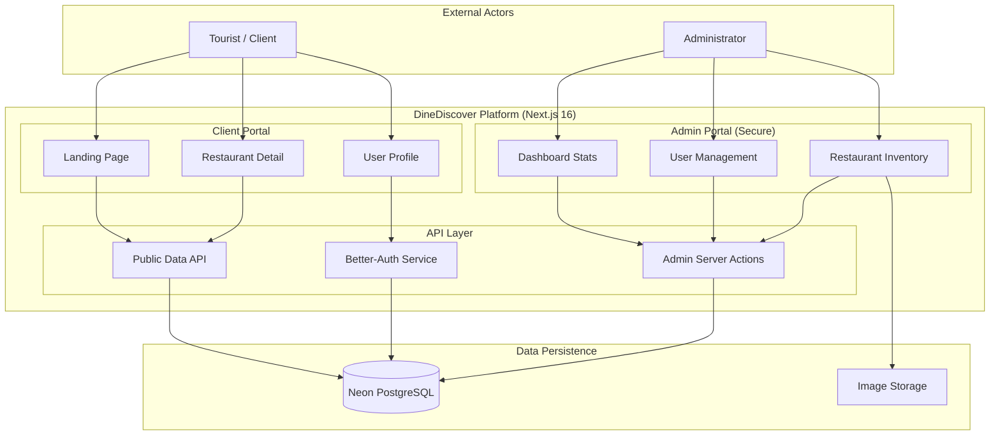
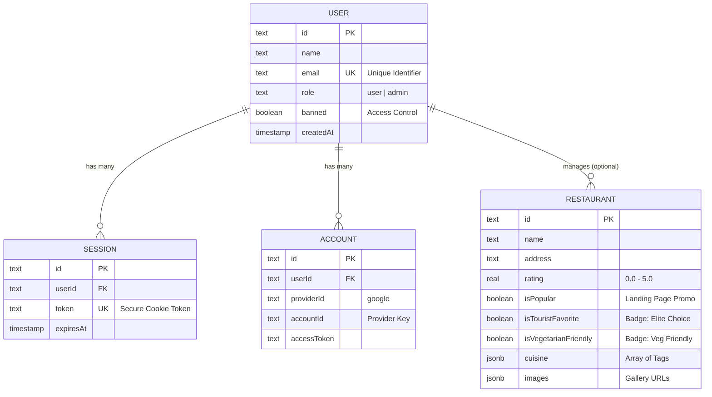
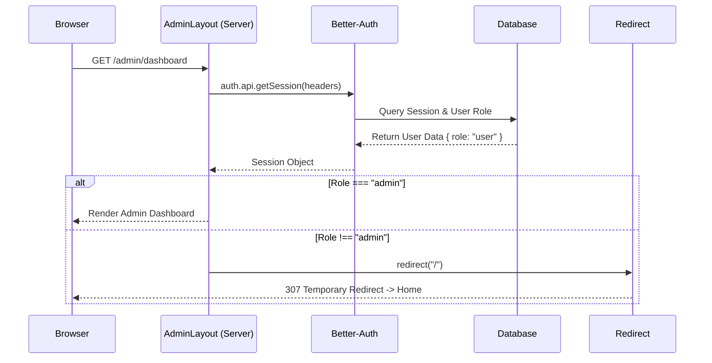
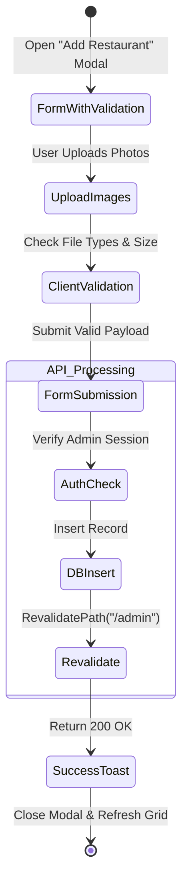

# 🏛️ Project Technical Blueprint

This document serves as the architectural handbook for the DineDiscover platform.

## 🏗️ 1. Architecture Overview

The high-level container architecture highlighting the separation between Client, Admin, and Data services.

---

## 🗄️ 2. Entity Relationship Diagram (ERD)

> [!NOTE]
> **Strategic Fields**: The fields `isPopular`, `isTouristFavorite`, and `isVegetarianFriendly` directly control frontend badges and section placement.

---

## 🔐 3. Security Architecture (RBAC Flow)

> [!IMPORTANT]
> **Security Guard**: This server-side check happens *before* any UI is rendered, ensuring no admin components leak to unauthorized users.

---

## 🔄 4. Core Workflows

### 4.1 Restaurant Creation Lifecycle

