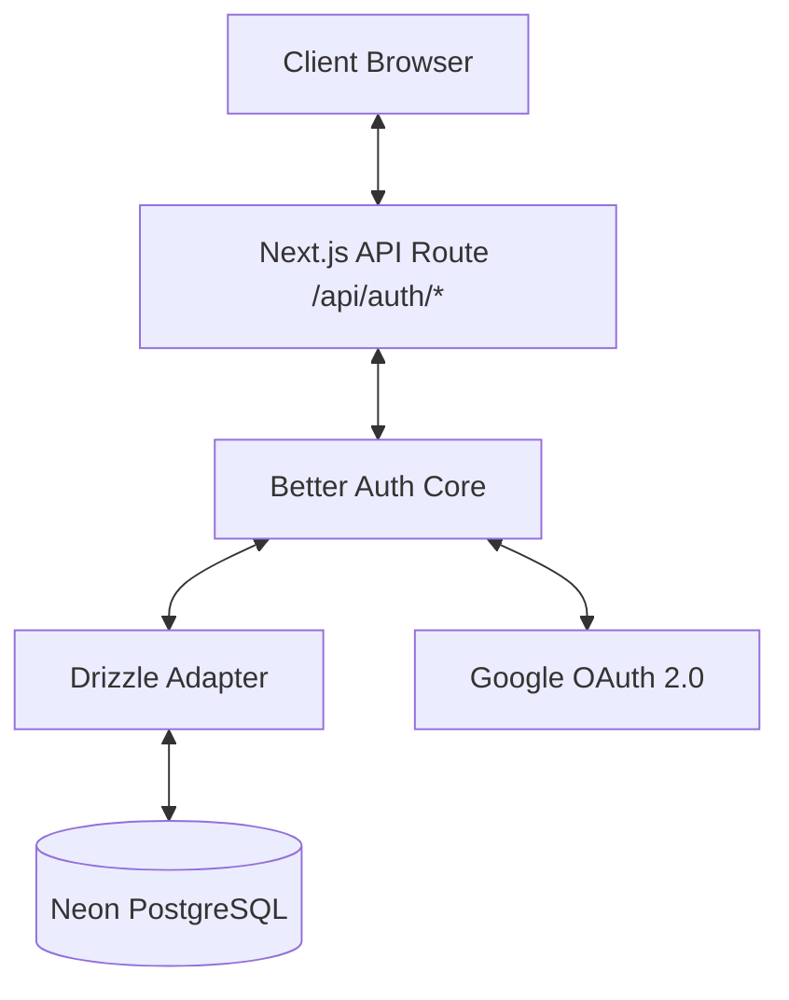
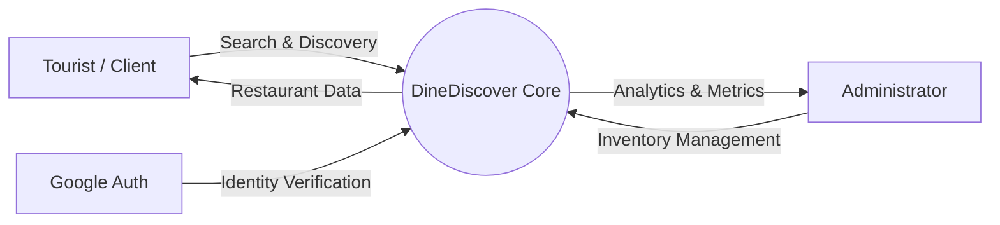
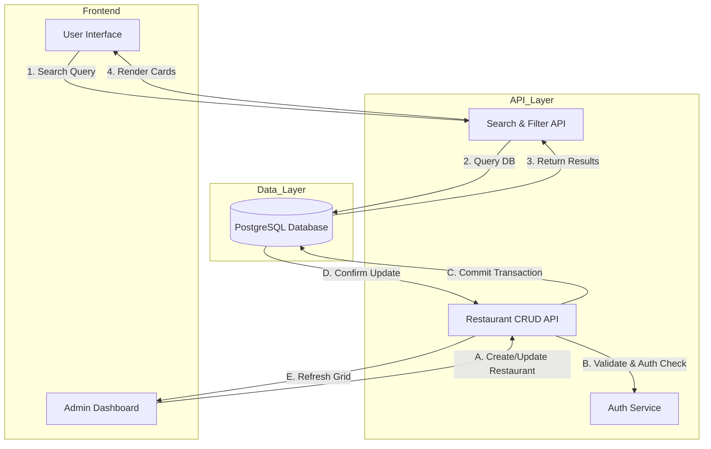

# DineDiscover System Documentation

## Chapter 1: Introduction

### 1.1 Project Overview
DineDiscover is a next-generation multi-restaurant discovery platform designed to bridge the gap between discerning diners and premium culinary experiences. It addresses the "Discovery Friction" faced by tourists and locals alike by providing a curated, high-performance interface for finding, viewing, and engaging with top-tier restaurants.

### 1.2 Purpose & Scope
The primary purpose of the system is to provide a seamless, dual-interface platform:
1.  **Client Portal:** A public-facing web application for users to search, filter, and view restaurant details with a focus on speed and visual fidelity.
2.  **Management Portal:** A secure, role-based administration dashboard for restaurant owners and platform admins to manage inventory, analyze metrics, and control promotional content.

### 1.3 Key Features
-   **Curated Discovery:** Algorithms to highlight "Popular," "Elite Choice," and "Vegetarian Friendly" establishments.
-   **Instant Search:** Real-time filtering by category, price, and location.
-   **Rich Profiles:** Detailed restaurant pages with menus, galleries, and reviews.
-   **Secure Authentication:** Robust user management via Better-Auth with Google OAuth integration.
-   **Role-Based Access Control (RBAC):** Granular permissions for Admins and Users.

---

## Chapter 2: Requirements Analysis

### 2.1 Functional Requirements
-   **User Authentication:** Users must be able to sign up, log in (Email/Google), and manage their profiles.
-   **Restaurant Management:** Admins must be able to Create, Read, Update, and Delete (CRUD) restaurant listings.
-   **Search & Filtering:** verification of search inputs and filter toggles (Price, Category, Attributes).
-   **Data Persistence:** All meaningful data (Users, Restaurants, Reviews) must be stored in a relational database.

### 2.2 Non-Functional Requirements
-   **Performance:** The application must utilize Server-Side Rendering (SSR) for SEO and initial load speed.
-   **Scalability:** The database schema must support thousands of listings without degradation.
-   **Security:** Administrative routes must be protected by middleware guards; inputs must be sanitized.
-   **Accessibility:** UI components must adhere to WCAG standards (Contrast, Aria Labels).

---

## Chapter 3: System Design & Architecture

### 3.1 Tech Stack
-   **Frontend Framework:** Next.js 16 (App Router)
-   **Styling:** Tailwind CSS + Shadcn/UI
-   **Backend/API:** Next.js Server Actions & API Routes
-   **Database:** PostgreSQL (Neon Serverless)
-   **ORM:** Drizzle ORM
-   **Authentication:** Better-Auth

### 3.2 Database Schema Overview
The relational model consists of the following core entities:
-   **Users:** Stores credentials, roles (`admin`, `user`), and status (`active`, `banned`).
-   **Restaurants:** Stores core details (`name`, `slug`, `priceRange`), rich media (`images`), and strategic flags (`isPopular`, `isTouristFavorite`, `isVegetarianFriendly`).
-   **Sessions/Accounts:** Manages auth state and provider linkage.

### 3.3 Authentication Architecture
The system uses a highly secure, self-hosted auth solution:

### 3.4 Data Flow Diagrams (DFD)

#### Level 0: Context Diagram
This high-level view illustrates the interaction between external entities (Student/Tourist, Admin) and the Core System.

#### Level 1: Core Process Flow
A breakdown of how data moves through the primary application modules.

---

## Chapter 4: User Interface Design

### 4.1 Design Philosophy
The UI follows a **"Premium Minimalist"** aesthetic:
-   **Typography:** Urbanist (Sans-serif) for modern readability.
-   **Color Palette:** White/Slate foundation with a vibrant Orange-Red (`#FF6B35`) accent color for ease of action.
-   **Layout:** Card-based architecture with "Glassmorphism" touches for depth.

### 4.2 Core Components
-   **Hero Section:** Centralized search utility with high-impact visuals.
-   **Restaurant Card:** Horizontal (landscape) orientation presenting high-density information (Rating, Cuisine, Price) clearly.
-   **Admin Dashboard:** High-fidelity data grids with "HUD" style metrics for rapid decision-making.

---

## Chapter 5: Systems Development & Presentation

### 5.0 Introduction
This chapter elucidates the technical architecture and development lifecycle of the Restaurant Finder App (RFA). Originally conceived to solve "Discovery Friction," the system has evolved into a production-grade platform leveraging the **Next.js 16 (Turbopack)** ecosystem. It integrates robust authentication, role-based access control (RBAC), and a scalable PostgreSQL database to serve both tourists (Client) and administrators (Management).

### 5.1 Systems Development

#### Structural Architecture: The Modern Stack
The system is built upon a bleeding-edge stack designed for performance, security, and scalability:
1.  **Framework:** **Next.js 16** (App Router) with Turbopack for rapid development and optimized builds.
2.  **Database:** **PostgreSQL (Neon Serverless)** managed via **Drizzle ORM**. This replaces static JSON files with a live, relational data model.
3.  **Authentication:** **Better-Auth** provides a completely self-hosted, secure authentication solution, supporting Email/Password and Google OAuth with session management.
4.  **UI Library:** **Shadcn/UI** + **Tailwind CSS** enables a rapid, consistent, and accessibility-first design system.

#### Key Architectural Pillars
1.  **Role-Based Access Control (RBAC):**
    The system implements strict separation of concerns between `CLIENT` and `ADMIN` users. Middleware guards (`middleware.js`) and database-level roles ensure that only authorized personnel can access the Management Portal (`/admin`).

2.  **Data-Driven Rendering:**
    The frontend utilizes configuration-driven components (e.g., `Strategic Features` badges) to ensure scalability. New attributes can be added to the configuration constants without rewriting rendering logic.

3.  **Server Actions & API Routes:**
    Data mutation (creating restaurants, updating user roles) is handled via secure API routes (`/api/admin/...`) and Server Actions, ensuring sensitive logic never leaks to the client.

### 5.2 Systems Presentation

#### The Client Experience (Tourist-Centric)
The public interface is optimized for discovery and visual appeal:
-   **Strategic Badges:** "Elite Choice" and "Veg Friendly" badges instantly highlight key venue attributes on listing cards.
-   **Popularity Algorithm:** A dedicated "Popular" section showcases restaurants explicitly promoted by admins via the `isPopular` flag.
-   **Instant Navigation:** Next.js pre-fetching ensures near-instant transitions between listing and detail pages.

#### The Admin Experience (Management-Centric)
The Admin Portal (`/admin`) is designed for high-density information processing:
-   **High-Fidelity Tables:** Data grids prioritize crucial operational data (status, roles, inventory stats).
-   **Strategic Control:** Admins can toggle promotional flags (`Popular Site`) directly from the inventory list.
-   **Security Controls:** Interface guards prevent critical errors, such as an admin accidentally deleting their own account or removing the last super-admin.

#### Technical Highlights
-   **Live Database Sync:** Changes in the Admin Portal (e.g., updating a restaurant's price range) reflect instantly on the public site without re-deployment.
-   **Optimized Assets:** All imagery is processed via `next/image` to ensure fast loading even on 3G roaming networks typical for tourists.
