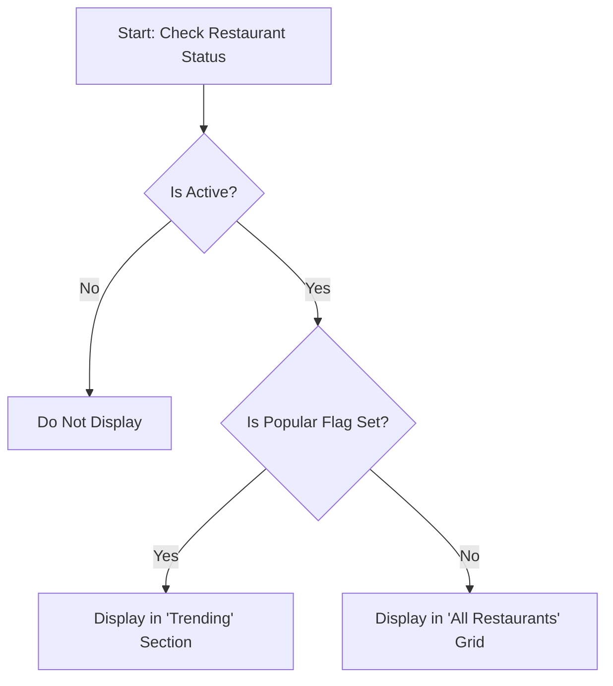
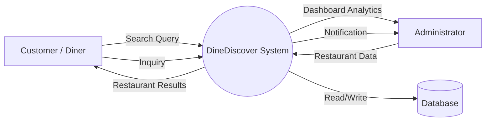
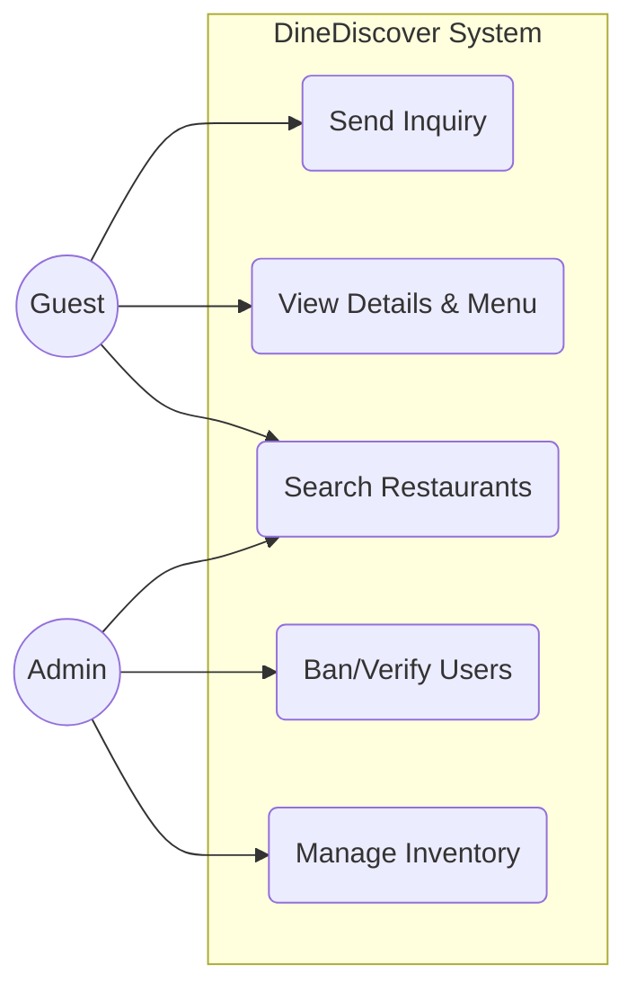
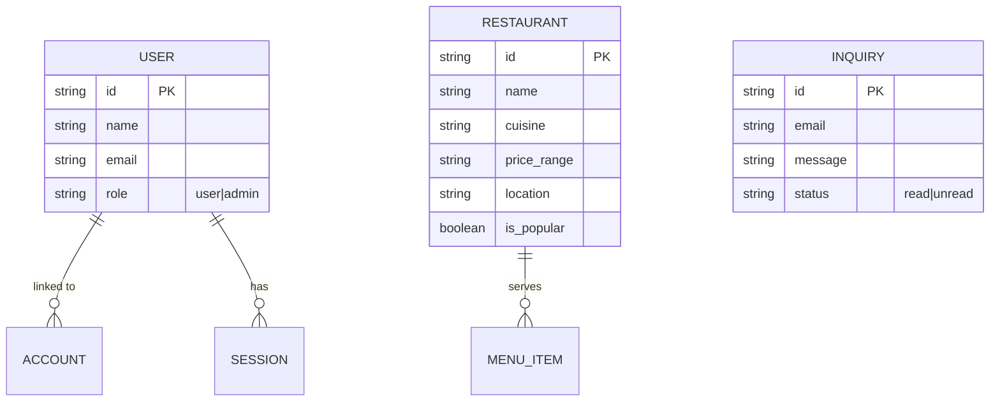

# CHAPTER FOUR: SYSTEMS ANALYSIS AND DESIGN

## 4.0 Introduction
This chapter details the systematic process of analyzing, designing, and modeling the "DineDiscover" multi-restaurant platform. It covers the transition from defining the problem to structuring the technical solution. We outline the feasibility of the project, define the functional and non-functional requirements, justify the architectural design choices (Component-Based/OOD), and present the system models including Data Flow Diagrams (DFD), Use Case Analyses, and Entity Relationship Diagrams (ERD).

## 4.1 Systems Investigation / Feasibility Study
Before development, a feasibility study was conducted to determine the viability of the "DineDiscover" project.

*   **Technical Feasibility:** The system utilizes robust, modern, and open-source technologies (Next.js, React, Node.js, PostgreSQL). These tools are well-documented, widely supported, and capable of handling the required traffic and data complexity. The technical risk is low.
*   **Economic Feasibility:** The project maximizes cost-efficiency by using Vercel (frontend hosting) and Neon (serverless database), which offer generous free/starter tiers. The use of open-source libraries (Shadcn UI, Tailwind) reduces development time and licensing costs. The return on investment (ROI) is driven by increased restaurant bookings and tourist engagement.
*   **Operational Feasibility:** The system is designed with a user-friendly interface for both tourists (discovery) and administrators (management). The learning curve is minimal, ensuring easy adoption by restaurant owners and end-users without extensive training.
*   **Schedule Feasibility:** The modular development approach allows for rapid iteration. Core features (MVP) can be deployed quickly, with secondary features added in subsequent sprints, ensuring the project meets critical deadlines.

## 4.2 Systems Requirements

### 4.2.1 Functional Requirements
These define what the system must do:
1.  **User Authentication:** Users must be able to sign up, log in (via Email or Google), and manage their profiles securely.
2.  **Restaurant Discovery:** Users must be able to search for restaurants by name, cuisine, or price, and filter results based on preferences.
3.  **Restaurant Details:** The system must display comprehensive information: descriptions, menus, location maps, operating hours, and photo galleries.
4.  **Admin Management:** Administrators must be able to Create, Read, Update, and Delete (CRUD) restaurant listings, manage user accounts, and view dashboard analytics.
5.  **Contact System:** Users must be able to send inquiries; Admins must be able to receive and manage these messages.

### 4.2.2 Non-functional Requirements
These define how the system performs:
1.  **Performance:** The application should load the landing page in under 2 seconds (using Next.js SSR/SSG).
2.  **Scalability:** The database and backend must handle concurrent users without degradation (Neon Serverless).
3.  **Security:** All API endpoints must be protected. Passwords must be hashed. Inputs must be validated to prevent SQL injection and XSS (Zod validation).
4.  **Availability:** The system should aim for 99.9% uptime via cloud hosting.
5.  **Usability:** The interface must be intuitive, accessible (WCAG compliant), and aesthetically pleasing ("Premium" design).

### 4.2.3 User Requirements
*   **Tourists/Diners:** Require a mobile-responsive interface to find food quickly while strictly on-the-go. They need visual confirmation (photos) and trust signals (ratings).
*   **Administrators:** Require a desktop-optimized dashboard to perform heavy data entry (uploading images, managing inventory) efficiently.

### 4.2.4 Systems Requirements (Hardware/Software)
*   **Client Side:** Modern Web Browser (Chrome, Firefox, Safari, Edge). Device: Smartphone, Tablet, or PC.
*   **Server Side:** Node.js Runtime Environment.
*   **Database:** PostgreSQL (v14+).
*   **Hosting Environment:** Vercel (Edge Network) or standard VPS (Ubuntu/Linux).

## 4.3 Design Approach [Object Oriented Design (OOD) / Component-Based]
The system employs an **Object-Oriented Design (OOD)** philosophy implemented through a **Component-Based Architecture**.

*   **Justification:** While Structured Design separates data and processes, OOD bundles data (state) and behavior (functions) into encapsulated units. In our context (React), these units are **Components** (e.g., `<RestaurantCard />` stores its own display logic and data usage).
*   **Modularity:** The application is built from small, reusable UI blocks (Buttons, Inputs, Cards). This makes the system easier to maintain and test compared to a monolithic structured design.
*   **Reusability:** A "Card" component can be reused on the Home Page, Search Page, and Admin Dashboard, reducing code duplication.

## 4.4 Systems Development Method
The project follows the **Agile Software Development** method.
*   **Iterative Approach:** We build the system in small increments (Sprints).
*   **Flexibility:** Requirements are refined based on immediate feedback (e.g., refactoring the Mobile Filters based on user testing).
*   **Continuous Delivery:** Features are deployed and verified continuously (CI/CD), ensuring a working product is always available.

## 4.5 System Interface [Both Desktop & Mobile]
The "DineDiscover" system features a **Responsive Web Interface** that serves **Both** Desktop and Mobile users from a single codebase.

**Justification for "Both":**
1.  **The Tourist Use Case (Mobile):** Our primary users are tourists exploring a city. They are rarely at a desk; they are walking or in a taxi. A **Mobile Interface** is critical for location-based discovery ("Restaurants near me") and quick decision-making. A desktop-only solution would fail to solve the "on-the-go" problem.
2.  **The Administrator Use Case (Desktop):** Managing a database of hundreds of restaurants, uploading high-resolution images, and analyzing charts requires screen real estate. A **Desktop Interface** is essential for productivity. A mobile-only admin panel would be tedious and inefficient for data entry.
3.  **Conclusion:** A single **Responsive Web Application** (using Tailwind CSS breakpoints) allows the layout to adapt dynamically. The Admin Panel sidebar is optimized for large screens, while the User Discovery flow uses Touch-friendly Sheets and Cards on mobile. This ensures the solution is appropriate for *all* stakeholders.

## 4.6 System Modeling

### 4.6.1 Problem / Decision Trees
*(Featured Restaurant Logic)*

### 4.6.2 Data Flow Diagrams (DFD) - Level 0

### 4.6.3 Use-Case Analyses

### 4.6.4 Entity Relationship Diagrams (ERD)

